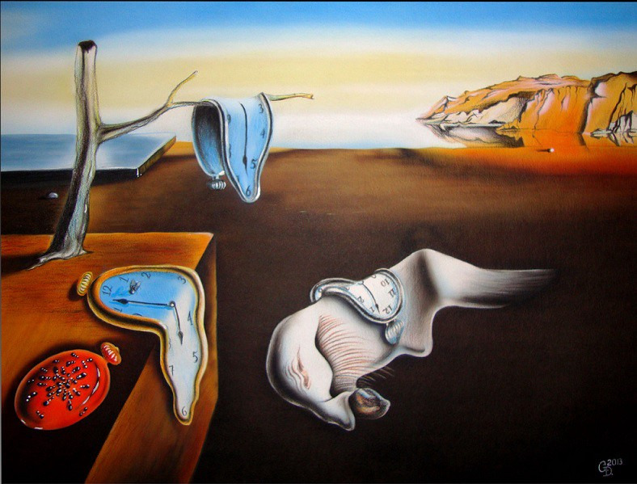
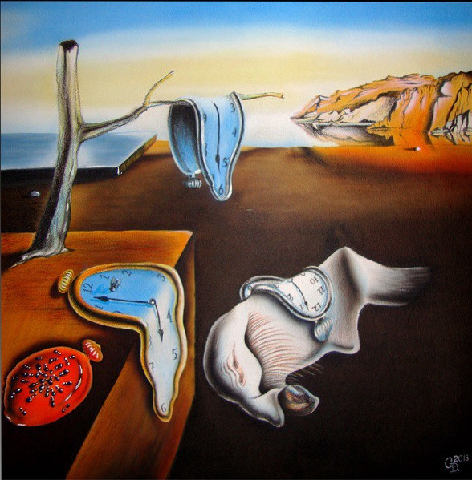

# Seam carving implementation written in c
### Images
This demo works only with images in `.ppm` (P3) format.
You can read about `.ppm` format [here](http://netpbm.sourceforge.net/doc/ppm.html).
You can use ImageMagick to convert `.ppm` P6 image to `.ppm` P3 image:
```
convert input.ppm -compress none output.ppm
```
### Installing and running
First of all compile `seam.c`:
```
gcc seam.c -o seam
```
After that run:
```
./seam <number of seams to delete> <input image name> <output image name>
```
### Samples
You can find some samples in `img` folder.
### Example
Original image:
  
After removing 200 seams:  

